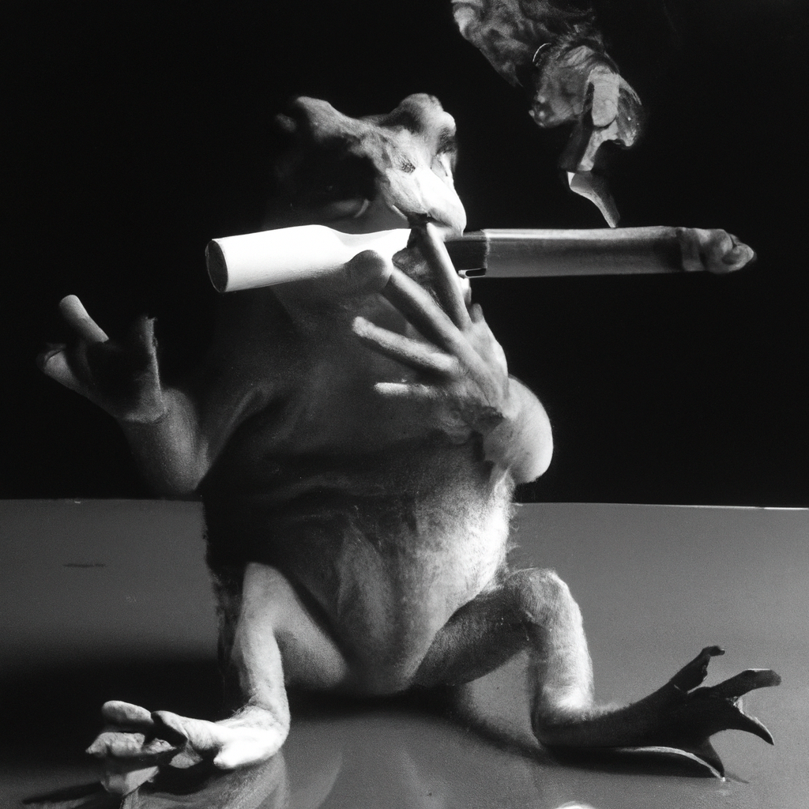

# ai generated artwork
use davinci-003 to generate a prompt for dall-e to generate "hd-photos"  

* api-key for openai is stored in repository secret OPENAI_API_KEY
* adust code.py to generate picture specific to your need
* use in codespace
* syntax: python code.py "describe your image"

## example
python code.py "frog with cigarette"  
-->  
generated prompt: "A sullen frog with a cigarette dangling from its mouth; its slimy skin is a murky shade of green, and its red eyes are filled with a mysterious intensity. It appears to be contemplating something deeply, as if it has a secret that no one knows." , HD photograph, nikon camera, studio lighting, on Kodak TriX film  

-->  

